# Jogurt na ranajky

Moj oblubeny, jednoduchy a (snad) zdravy ranajkovy mix.

## Priprava

Zaciname greckym jogurtom.

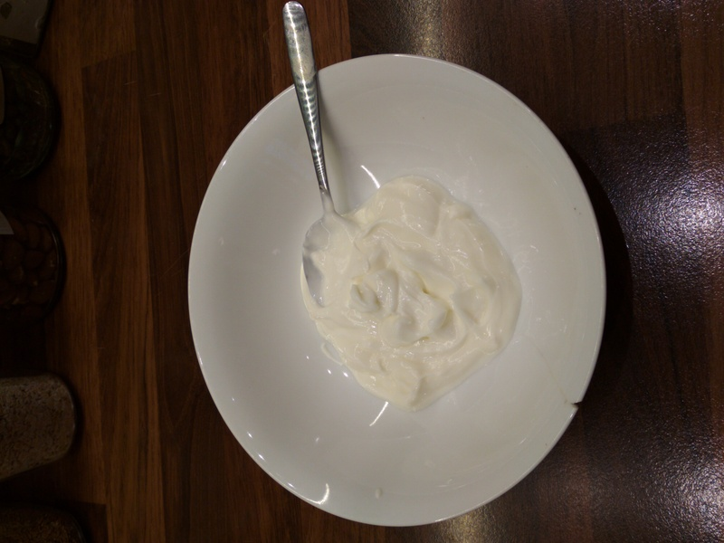

Pridame ovsene vlocky (neochutene):

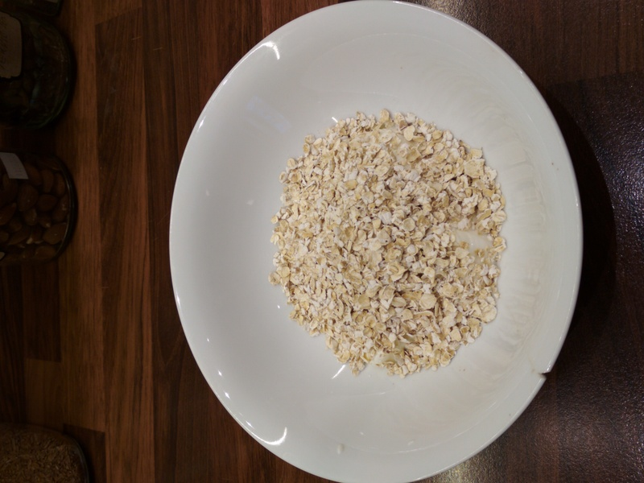

Potom tam dame lanove semienka:

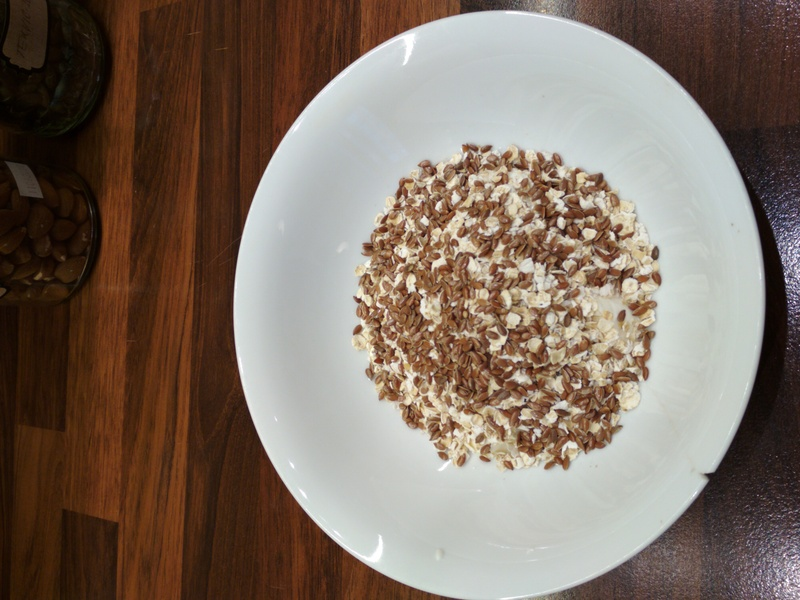

Chia semienka:

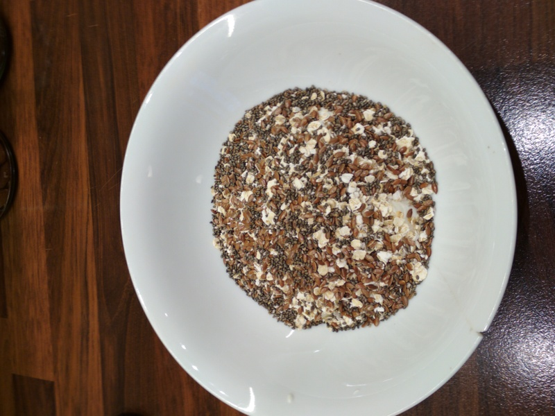

Goji semienka som objavil nedavno:

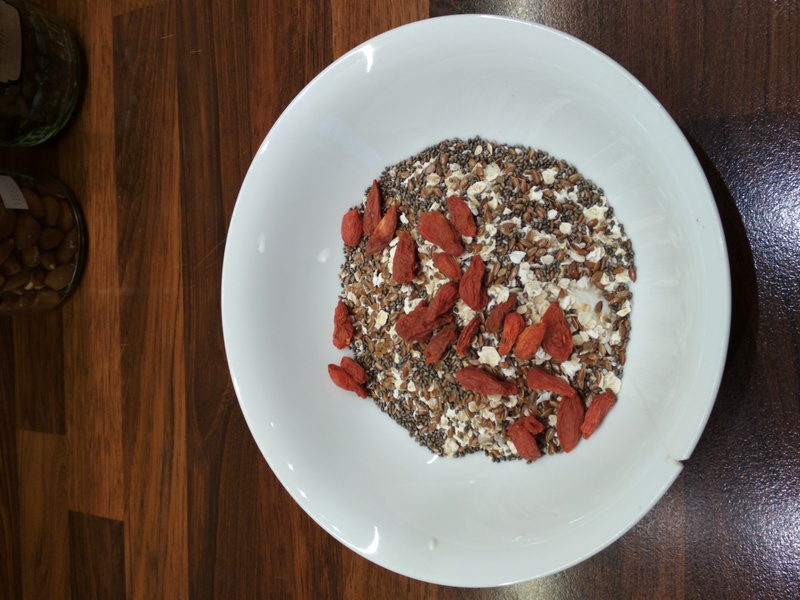

Nakrajame kesu orechy (preferujem male kusky):

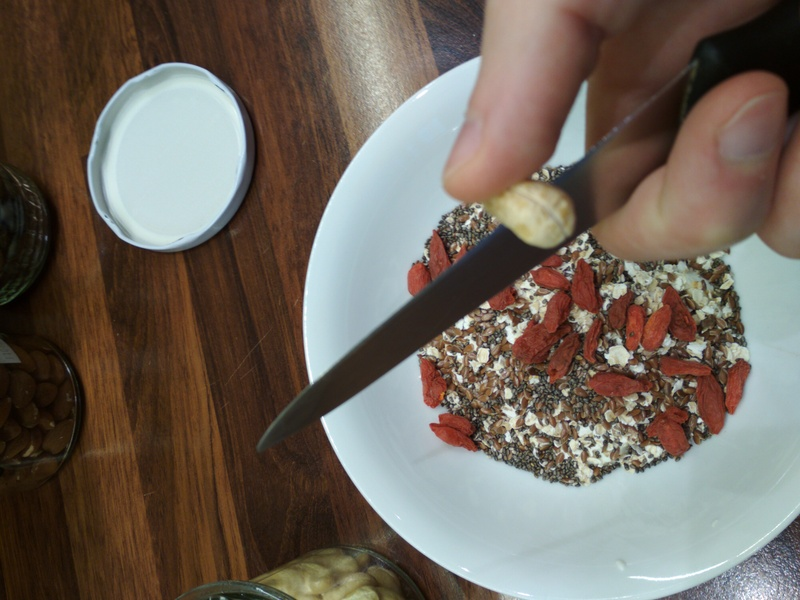
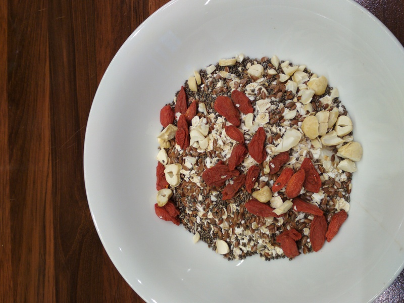

Slnecnicove semienka:

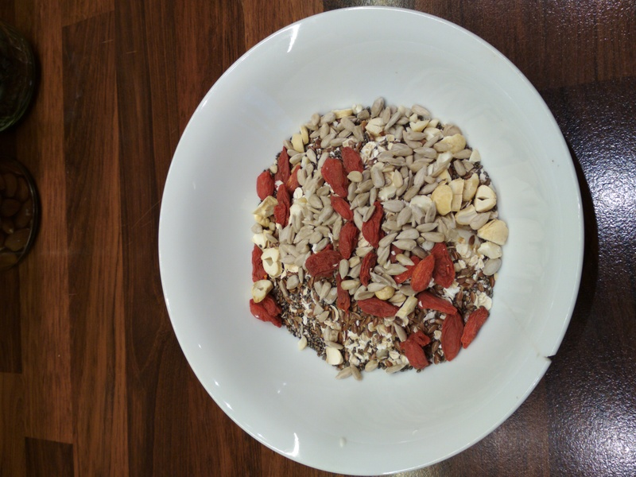

Tekvicove semienka:

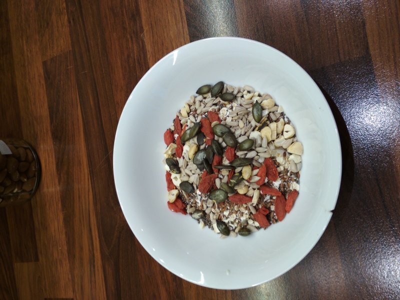

Mandle:

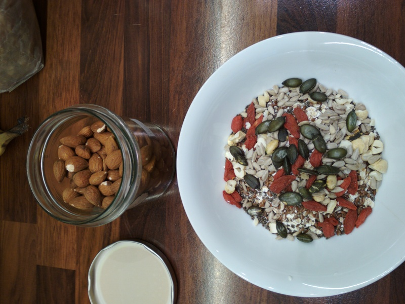

Vlasske orechy:

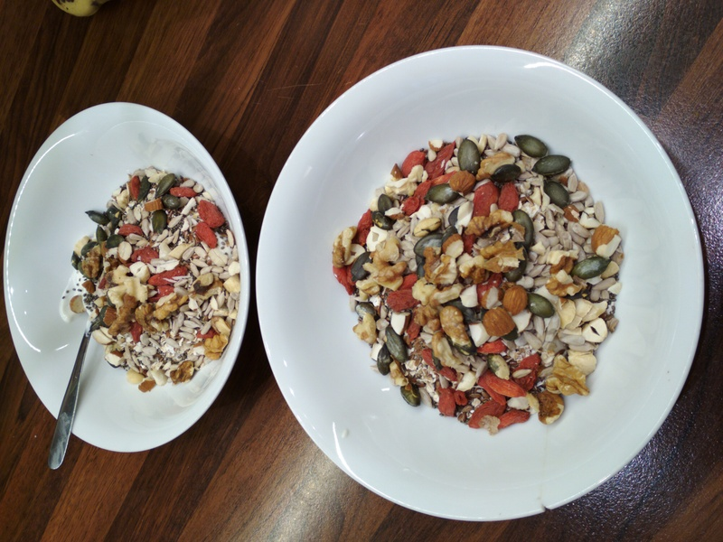

Ak mam doma, tak nakrajam si aj banan:

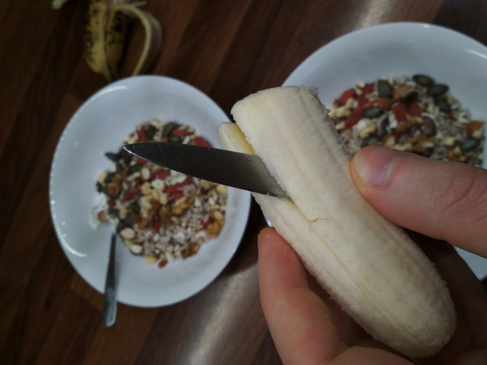
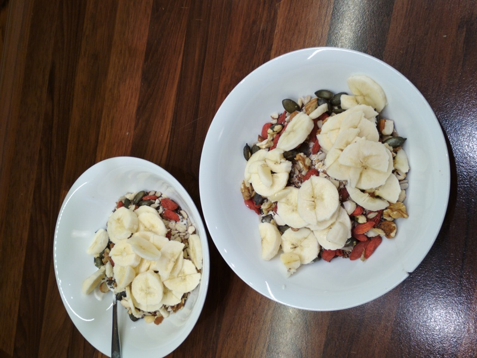

Niekedy tam dam aj cucoriedku:

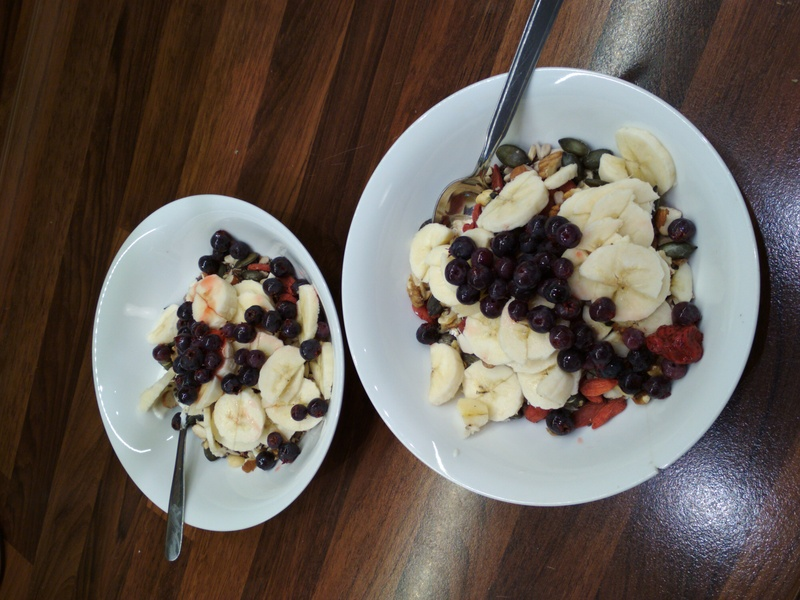

Najlepsim pridavkom je dobry med!

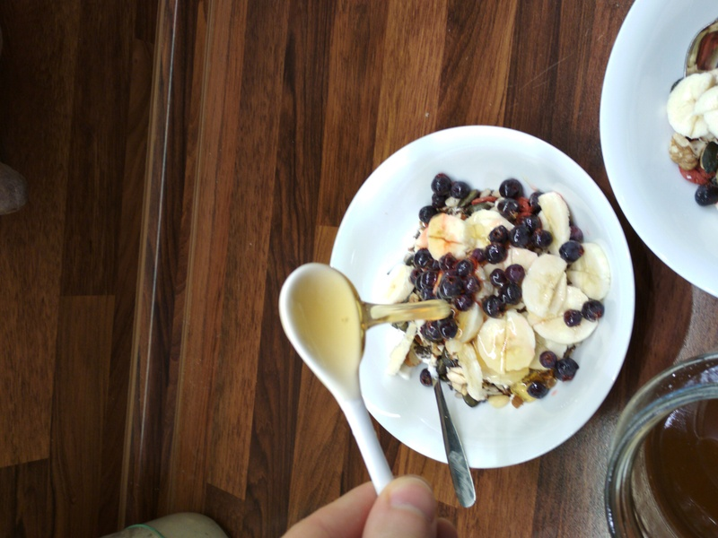

Dobru chut :)
