# Klicky

[Dalsie recepty](index.md)

Klicky. Alebo: ako mat chlieb s maslom a s redkovkou aj v januari.

## Ingrediencie

* Vhodne semienka
* Nadoba
* Voda

Semienka sa daju zohnat v roznych obchodoch - ide o semienka vyslovene urcene na klickovanie (napr. v bezobalovych obchodoch).

## Redkovka

Klicky redkoviek su velmi svieze a jemne pikantne.

### Priprava

Ja mam takyto set "Pohár na klíčenie" (kupoval som cez internet za cca 15€ bez postovneho). Ide o 700ml pohar, v ktorom budeme mat semienka, viecko so sietkou a stojan (GEO je len nahoda).

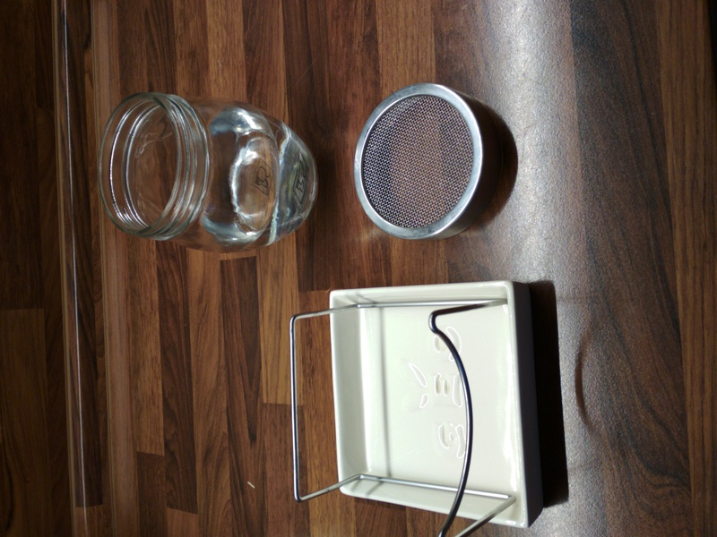

Ideme klickovat redkovku. Prvym krokom je namocenie semienok do vody. Rozne semienka vyzaduju roznu dlzku namacania. Redkovka vyzaduje 4 hodiny, mungo fazula 12 hodin.

Dame do vody 2 cajove lyzice semienok (ono to dost potom rozrastie). Semienka by mali byt ponorene do vody.

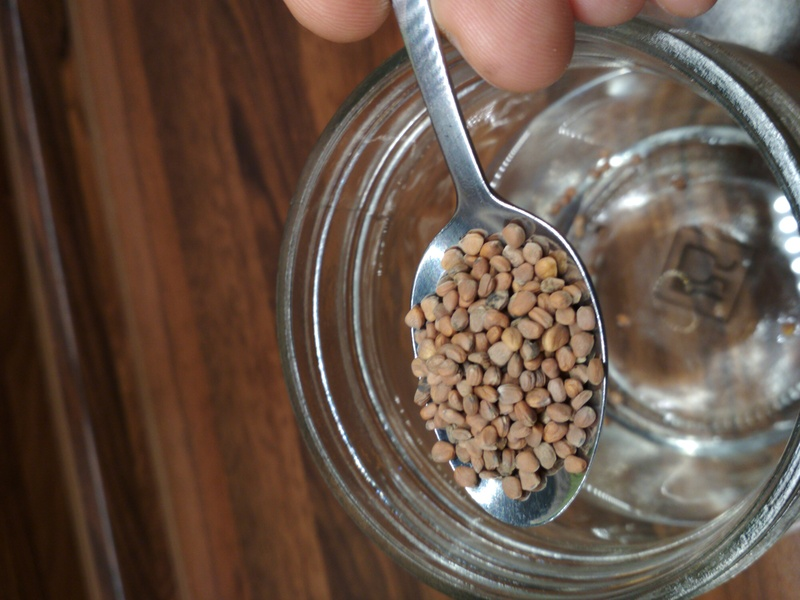
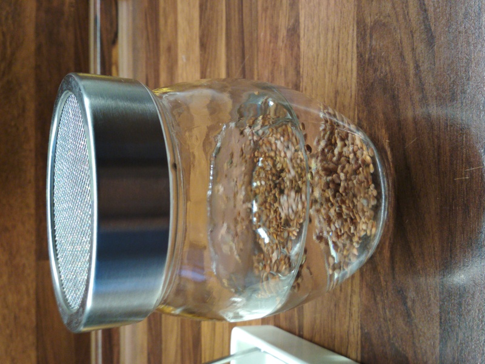

Neviem, do akej miery vadi semienkam slnko; ja ich drzim v tme. Pouzivam original obal z pohara.

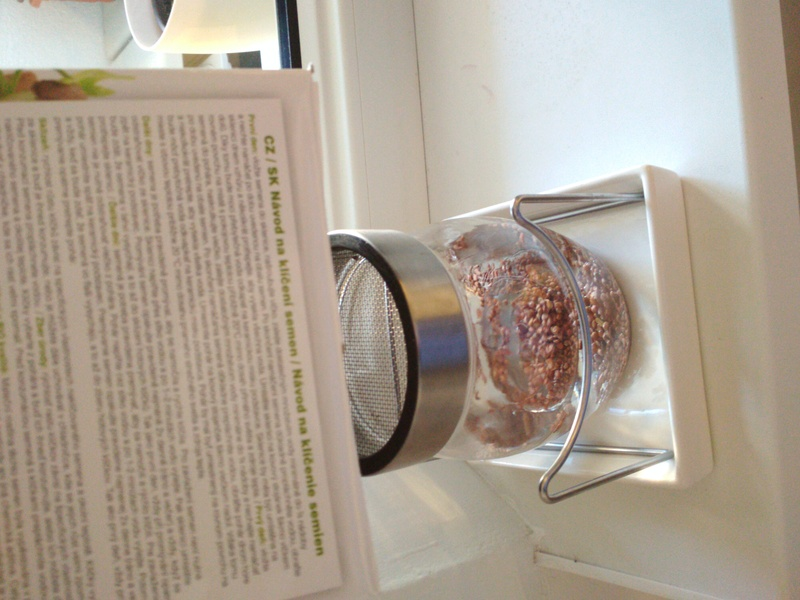
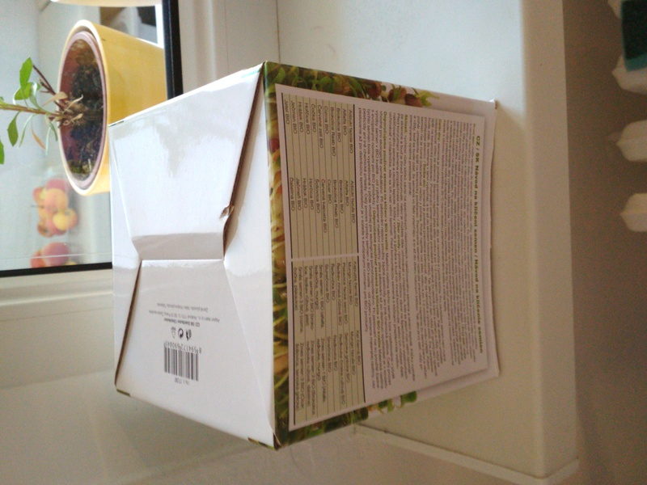

Po styroch hodinach vylejeme vodu z pohara.

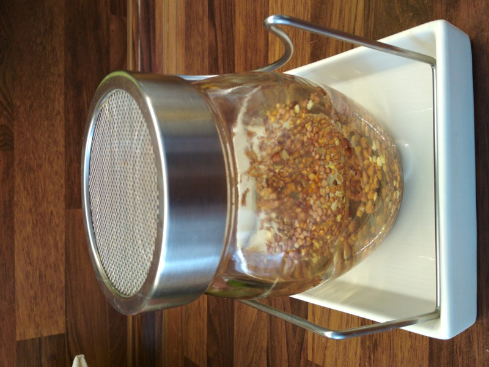
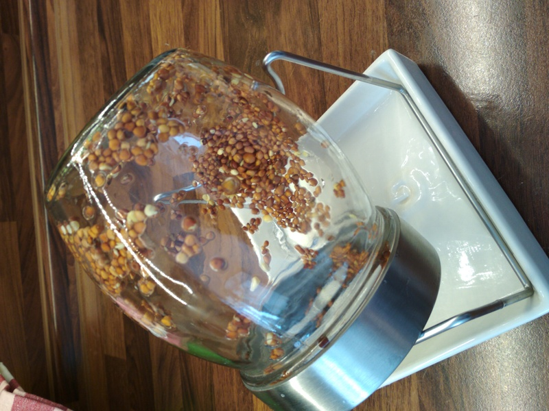

Odteraz mame jedoduchu ulohu. Staci 3-4x denne preplachnut semienka vodou, pricom nadalej ich drzim v tme. Je dolezite, ze semienka nemaju stat vo vode, aby napr. nezacali hnit alebo plesniviet. Preto mam aj ten stojan - pohar otocim dole hlavou a po preplachnuti vodou zvysok vody vytecie do tej spodnej nadoby.

Za 1 den uz vidime, ze semienka sa rozklicili.

Po dalsich 12 hodinach mame takyto stav:

Po dalsich 12 hodinach vyzera redkovka takto:

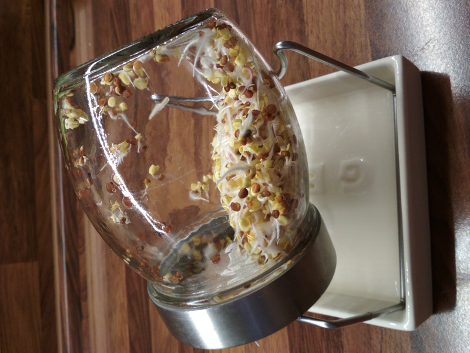

Redkovka po dalsich 12 hodinach vyzera takto:

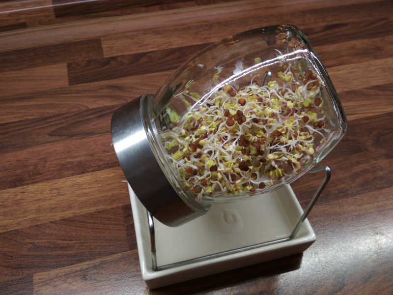

Po dalsich 12 hodinach uz je to skoro hotove:

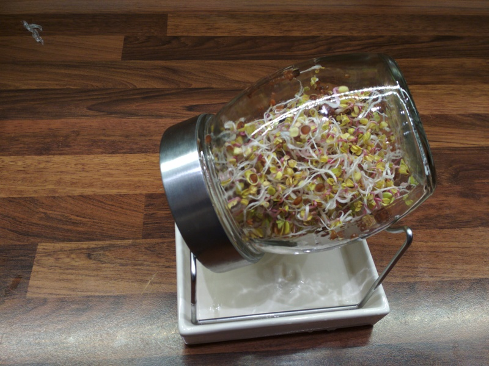

Klicky uz su dost velke po cca 3 dnoch. Kedze to cele bolo v tme, tak aj tie prve listy su skor take zlte. Ja robim potom to, ze ich odkryjem na par (4-8) hodin tak, aby klicky dostali nepriame slnko/svetlo (napr. na kuchynskej linke). Vdaka tomu tie listy zozelenaju:

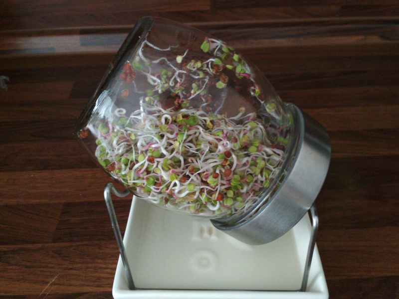

Klicky su pripravene na konzumaciu. Ked si dam cestvy kvaskovy chlieb s klickami, tak okamzite sa vratim v case - mam zrazu desat rokov, nemam ziadne starosti, je leto, vonku teplo a mama mi robi chlieb s redkovkou na desiatu :)

Klicky vlozim do uzatvaratelnej nadoby a skladujem ich v chladnicke. Vacsinou ich zjem do cca 3 dni.

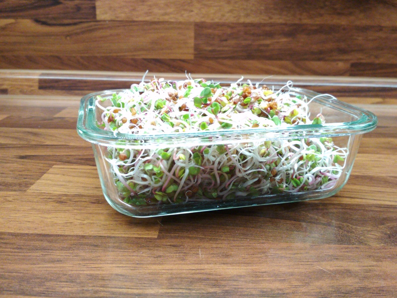

## Mungo fazula

Dalsim mojim oblubenym semienkom je fazula mungo. Chuti to viac po fazuli, je to super napr. do polievky, alebo.. len tak :)

### Priprava

Mam aj takyto hlineny set na klickovanie (stalo to cca 8€. Zohnal som to v bio shope). Na zaciatku som tuto nadobu pouzival aj na redkovku. Funkcne to bolo, ale tie male semienka redkovky upchali dierky tej nadoby a potom voda nemohla vytiect von. Tato nadoba je dobra skor na vacsie semienka, ako napr. mungo, hrasok atd.

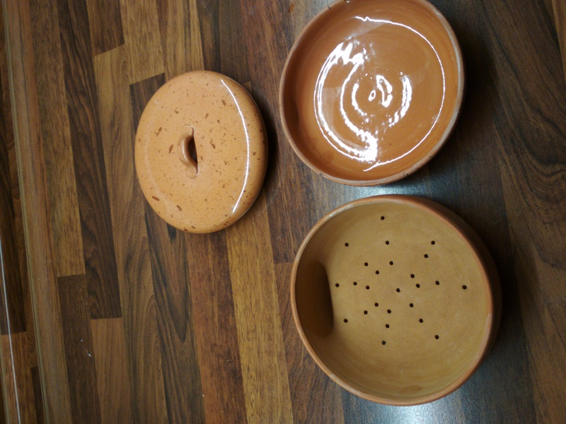

Semienka munga dam na 12 hodin namocit do vody (to je ta nadoba bez dierok :) ).

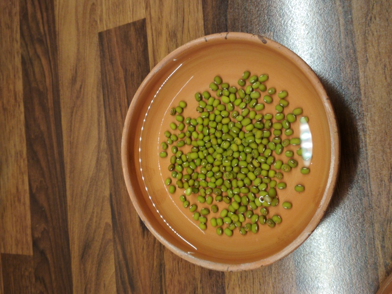

Nadobu zakryjem, aby semienka boli v tme.

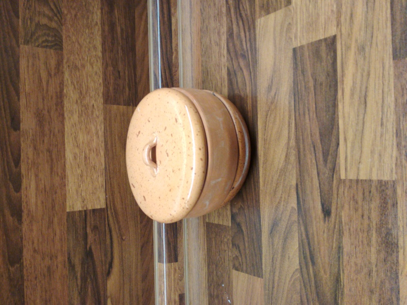

Po 12 hodinach semienka premiestnim do nadoby s dierkami (na odtekanie vody) a tiez cca. 3-4x denne ich preplachnem vodou.

Po 24h mame takyto stav:

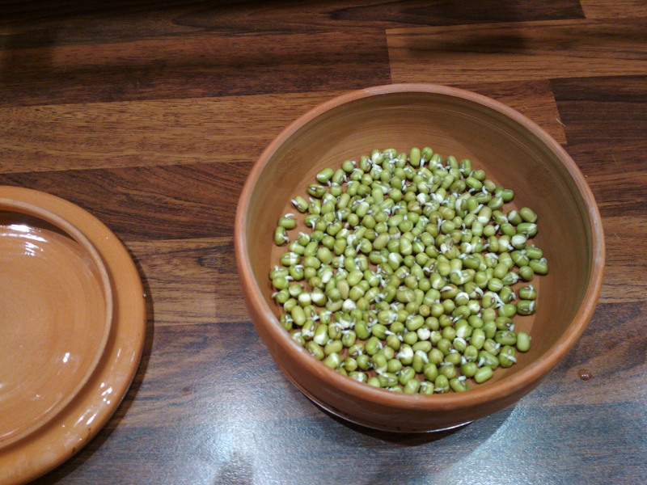

Po 24h mame takyto stav:

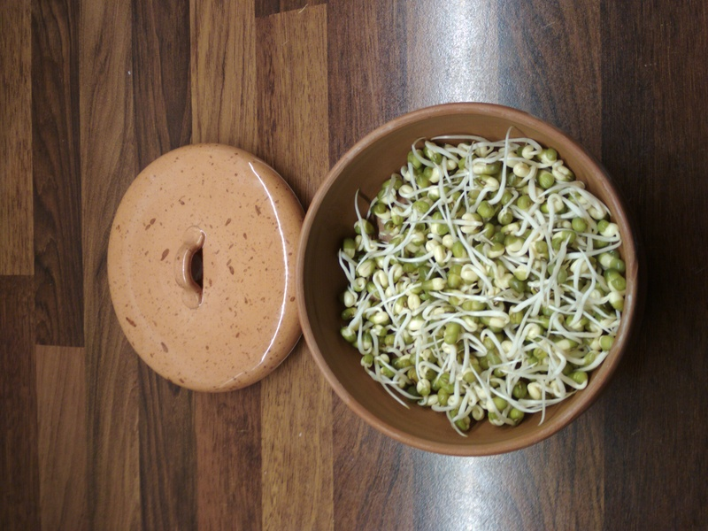

Klicky su pripravene na konzumaciu. Mungo klicky su hotove celkom rychlo - aj preto su take oblubene.

Vyskusaj, neolutujes.
