# Ako krmit kvasok

[Dalsie recepty](index.md)

## Ingrediencie

* kvasok (funkcny; zatial som nikdy nestartoval novy kvasok, cize ten proces zatial neviem popisat)
* voda
* razna muka
* vaha

Kratky popis najdete na konci :)

## Predslov

Najviac kvasku pouzivam pri peceni chleba (280g). Tento navod je sice univerzalny, ale konkretne cisla (kolko kvasku drzim v chladnicke a ako krmim) pouzivam prave pri tom chlebe. Ak potrebujem menej kvasku, napr. 1 polievkovu lyzicu, tak kvasok krmim pridanim len ~40g muky a ~40g vody

Ak clovek uz vie, ze co a preco robi, tak cele krmenie (okrem cakania) trva 1-2min.

Nejdem opisovat teoriu o kvasku (kto chce vediet, nech to pohlada na internete niekde). V skratke kvasok zabezpecuje, aby napr. nas chlieb bol pekne nadychnuty a narasteny (a aby sme nemali namiesto chleba kus kamena, co sa neda jest).

Kvasok sa sklada z vody, muky a bakterii, ktore sa nachadzaju vsade okolo nas (vo vzduchu). Cize je to voda a muka :)

Krmenie kvasku spociva v pridani vody a muky k existujucemu kvasku. Krmenim kvasok nabere silu a zvysuje svoj objem. Nikdy nepouzivam 100% kvasku. Namiesto toho vzdy krmim kvasok tak, aby po odobrati urciteho mnozstva do nejakeho receptu mi zostal napr. 100g kvasku, aby som potom dalsim krmenim ten kvasok mohol pouzit neskor. Cize neustale pouzivam ten isty kvasok a v zasade to, co odoberem do receptu doplnim naspat krmenim.

Ak by som toto nerobil (tj. by som pouzil vsetok kvasku), tak nabuduce by som musel robit nanovo cely kvasok, co trva mozno 5-7dni (krmenie trva ~4h; navyse sa hovori, ze cim starsi kvasok, tym je lepsi, silnejsi a odolneji).

Je to teda nekonecny proces odobratia casti kvasku do receptu a krmenia.

Kvasok pri izbovej teplote vyzaduje krmenie kazdy den. Ked ho ale dame do chladnicky (cim spomalime vsetky chemicke procesy v nom), tak ho staci nakrmit raz za tyzden (minimalne tak casto peciem aj chlieb). Cize kvasok mam cely tyzden v chladnicke, potom ked chcem piect chlieb, tak ho vyberem, nakrmim, pockam si a odoberem do cesta. Potom kvasok vratim do chladnicky.

S kvasok je vsetko pomale :) Chce to proste cas. Samotne krmenie potrva ~4h (chvalabohu nemusime byt pri tom cely cas. Pridanie vody a muky potrva 1 minutu, potom uz len treba pockat, kym kvasok narastie).

Na konci krmenia je kvasok aktivny a silny. Vzdy ho pouzivam v takom stave (napr. nikdy nie cerstvo z chladnicky; vzdy ratam s tym, ze po vybrati kvasku z chladnicky potrebujem kvoli krmeniu ~4h casu, kym ho mozem pouzivat).

S tym krmenim a pecenim chleba to mam cele tak vypocitane, ze nemusim vyhodit kvasok do kosa. Len tolto krmim, kolko aj potom odoberem. Ak by som chvilu nechcel piect chlieb, tak 1x/tyzden by som kvasok vybral z chladnicky, nakrmil a cast kvasku vyhodil do kosa.

Experimental: uz som 2x dal uspecne kvasok aj do mraznicky, ked som isiel na 2 tyzdnovu dovolenku. Zatial to kvasok vzdy prezil :) Po navrate som vybral kvasok na linku, aby sa rozmrzol a potom som ho 2 dni po sebe nakrmil s tym, ze som ho nechal na linke.

## Priprava

Ku krmeniu kvasku potrebujeme muku, vodu, odmerku, vahu a polievkovu lyzicu.

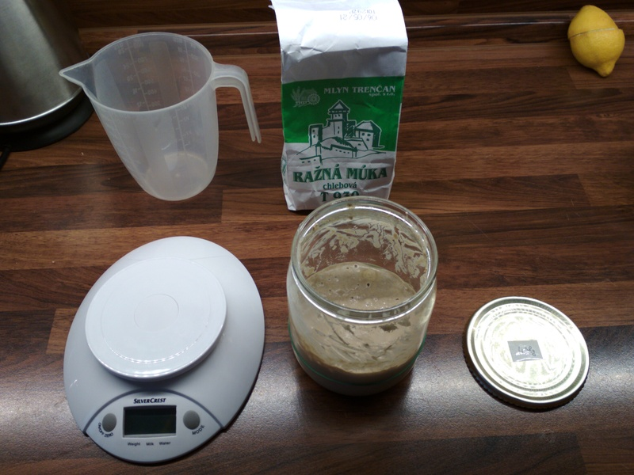

Kazda muka je ina, tak sa snazim pouzivat na krmenie vzdy tu istu (pri peceni chleba zvyknem experimentovat s roznymi kombinaciami muk). Moj kvasok krmim vzdy raznou mukou, konkretne s tymto typom:

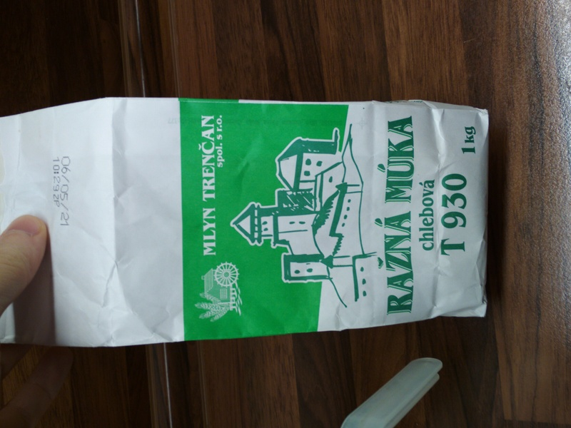

Kedze kvasok drzim v sklenenom pohari (co nieco vazi), tak je tazke vediet, kolko kvasku v nom realne mam. Preto som si odvazil cisty pohar a hmotnost som nalepil na vrsok:

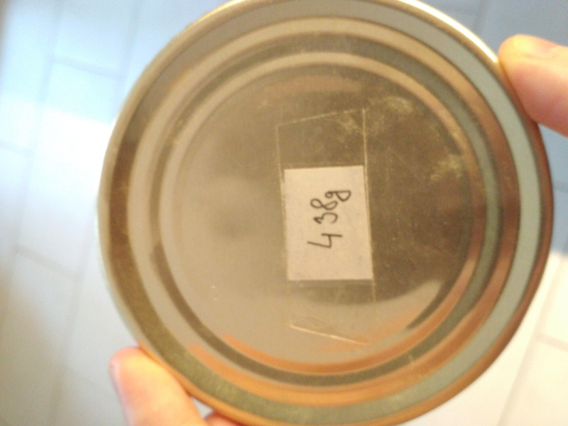

Moj pohar teda vazi 438g, cize v tomto pripade v nom mam 707-438=269g kvasku:

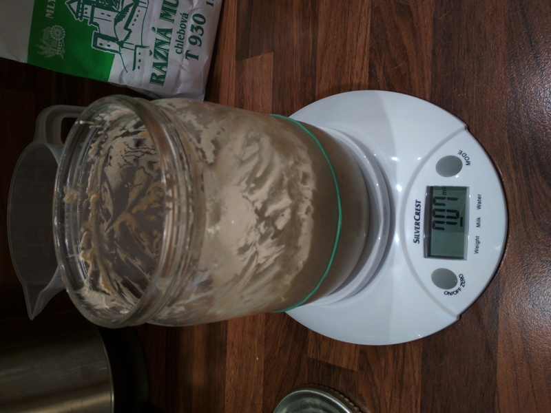

## Krmenie - teoria

Pri krmeni vzdy pouzivam rovnake mnozstvo vody a muky (pomer 1:1; napr. 50g vody + 50g muky). To, kolko "krmiva" pridam do kvasku zavisi od toho, kolko budem chciet odobrat do nejakeho receptu. Najviac kvasku potrebujem pri peceni chleba (recept coming soon) - konkretne 280g.

Pri krmeni si davam pozor na tieto veci:

* kvasok po nakrmeni vzdy narastie aspon na dvojnasobok objemu. Toto musim brat do uvahy pri krmeni, aby mi kvasok z pohara nevytiekol. Ako aj na obrazku vyssie je vidno, tak nedrzim vela kvasku v pohari.
* kvasok krmim maximalne svojou hmotnostou, tj. ak mam 100g kvasku, tak pri krmeni pouzivam maximalne 50g vody a 50g muky.

Kedze najviac kvasku (280g) potrebujem na chlieb, tak zvyknem v chladnicke drzat cca 280g kvasku (pozor - hmotnost pohara som odratal!). Potom to prikrmim ~100g vody a ~100g muky, vdaka comu budem mat 480g kvasku a po odobrati mi zostane ~200g. Pri takmto nastaveni mi kvasok narastie priblizne po vrch pohara (a nie viac ;)).

Po odobrati kvasku do receptu potom kvasok este raz dokrmim do hmotnosti 280g, pockam, kym narastie a potom ho dam do chladnicky. Taketo dvojite krmenie robim preto, aby som nekrmil kvasok o viac, ako svoja hmotnostou a aby som nemusel vela kvasku drzat v chladnicke (ak mam vela kvasku, tak mi to po krmeni moze vyliat z pohara).

Samotny proces krmenia trva par hodin (vid popis/obrazky nizie) a jednym indikatorom konca tohto procesu je, ze kvasok narastie aspom na dvojnasobny objem. Na sledovanie rastu pouzivam gumicku na pohari, ktoru nastavim do vysky hladiny kvasku hned po krmeni.

Kvasok nestraca hmotnost pocas krmenia, cize ak mam 100g kvasku a pridam 15g vody a 15g muky, tak po 4-5 hodinach budem mat 130g kvasku.

## Krmenie - prax

Umyjem si ruky (aby som do kvasku nedostal spinu, alebo bakteria z telefonu).

Kvasok vyberem z chladnicky a dam ho odvazit. Mam 707-438=269g kvasku v pohari (obrazok vyssie). Vahu vynulujem.

Pridam 110g vody a 110g raznej muky (aby som mal ~480g kvasku - vyssie som pisal, ze v chladnicke drzim 280g kvasku. V tomto pripade toho bolo menej, tak som pouzil o 10g viac vody a muky). Pouzivam studenu vodu (nie ladovu) - niekto pouziva skor vlaznu.

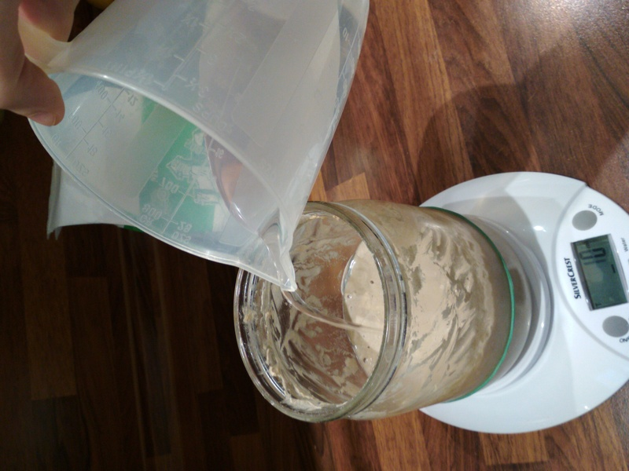
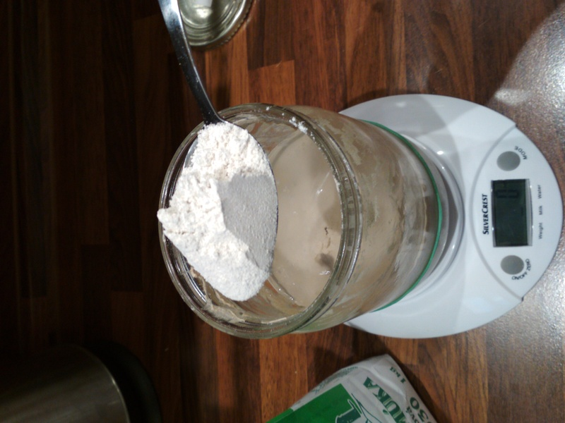

Na konci krmenia budem mat 927-438=489g aktivneho kvasku:

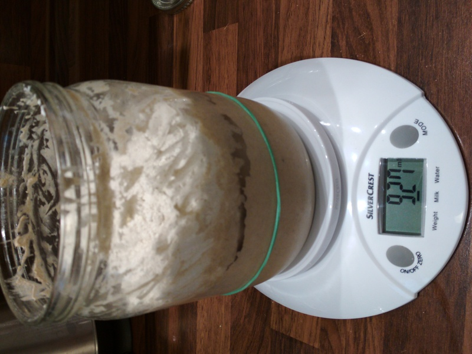
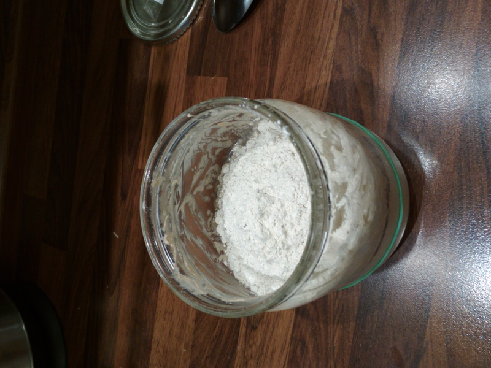

Zoberem lyzicu a cele to pomiesam:

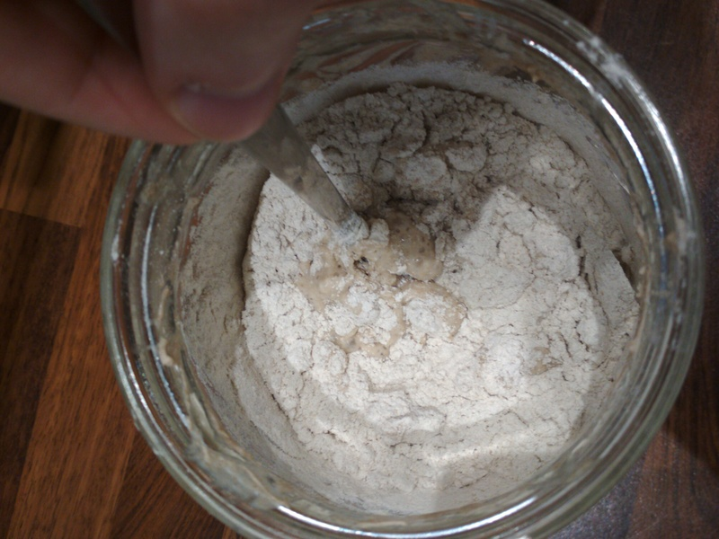
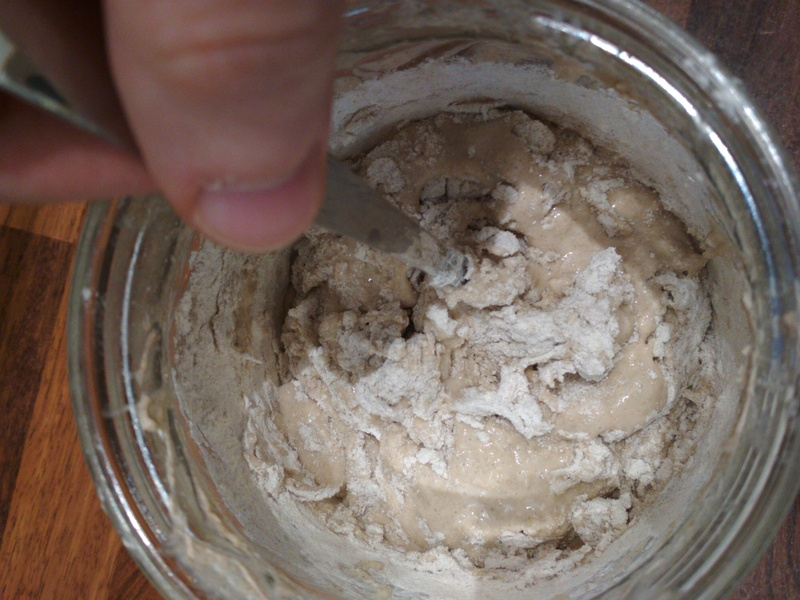
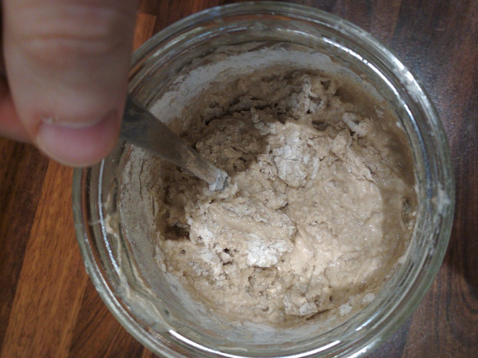

Miesam, kym vidim muku. Treba pomiesat poriadne aj spodok pohara.

Lyzicu ocistim prstami. Kvasok je taky lepkavy, nic si z toho nerob :) Odporucam lyzicu hned umyt.

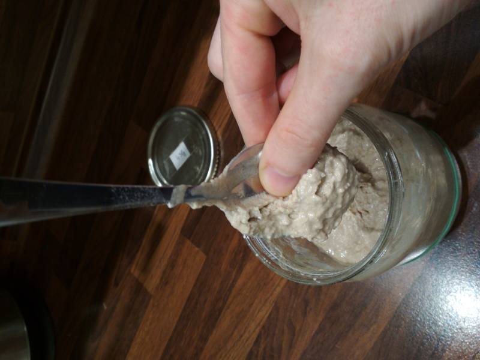

Nezabudni trosku ocistit aj steny pohara (lyzicou). Nastav gumicku podla hladiny kvasku:

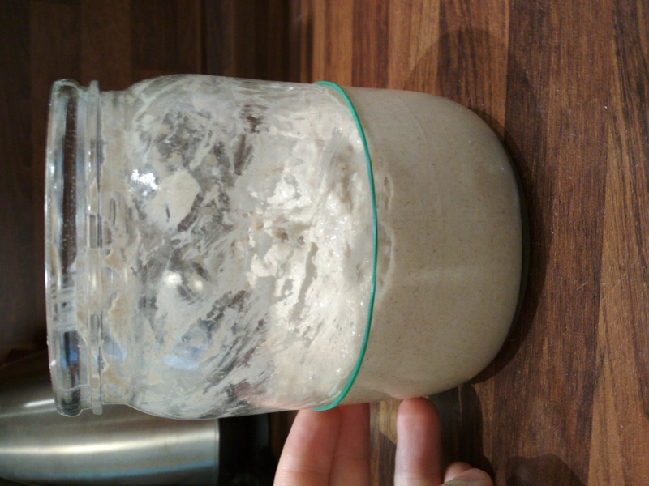

Zakri pohar (netreba to uplne zatvorit, aby sa don dostal trocha vzduchu) a odloz ho niekam napr. na kuchynsku linku (nemalo by na to priamo piect slnko):

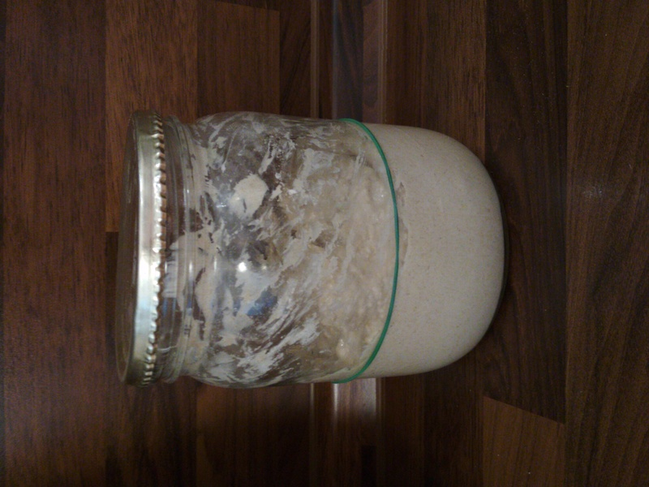

Po 2h30m uz kvasok viditelne narastol:

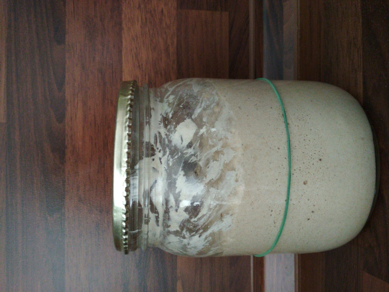

Za dalsich 30m este viac:

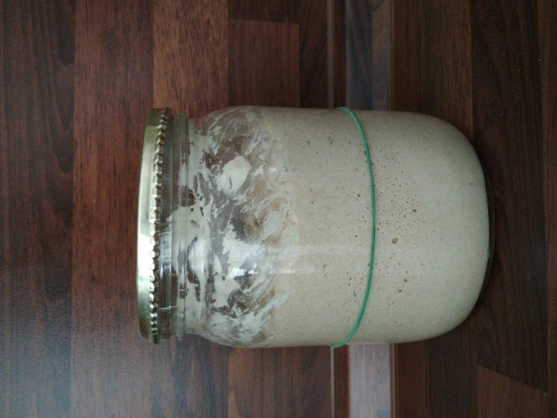

Za dalsich 45m este viac (uz narastol trosku viac, ako na dvojnasobok):

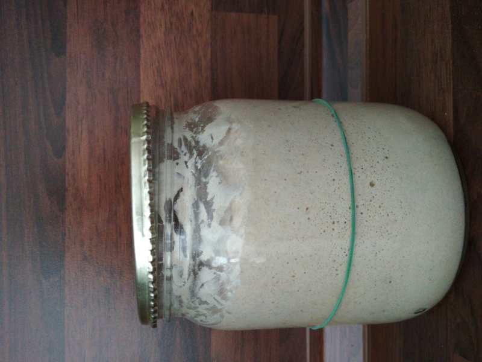

V takomto stave je uz kvasok aktivny, cize uz by som z neho odobral do receptu. Ak niekto chce uplne pockat koniec krmenia, tak treba to nechat stat dovtedy, kym vrch kvasku je obly (konkavny) - tj. kvasok este viditelne rastie. Akonahle prestane kvasok rast a zacina zapadnut dole, tak uz "zjedol vsetok krmiva" a proces krmenia je uplne dokonceny.

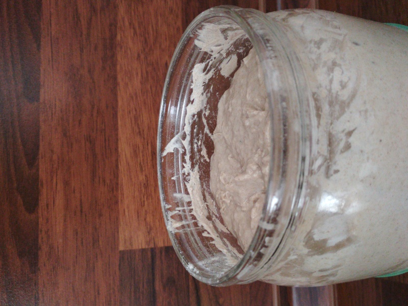

## Krmenie v 5 minutach

* Vyber kvasok z chladnicky
* Odvaz ho aj s poharom, odcitaj hmotnost pohara a zisti, kolko mas kvasku (napr. 280g)
* Zisti, kolko chces mat kvasku (podla toho, kolko potrebujes do receptu, s tym, ze ti musi aj zostat). Povedze si, ze chceme mat 480g.
* Pridaj 100g vody a 100g raznej muky (pomer 1:1)
* Kvasok poriadne pomiesaj (aj spodok), kym vidis v nom muku
* Nastav gumicku podla hladiny kvasku
* Zakri pohar (nie uplne, aby sa dostal do pohara vzduch) a nechaj kvasok "pracovat"
* Po cca 4 hodinach mozes pozorovat, ako kvasok narastol na dvojnasobok svojho objemu
* Odober kvasok do receptu

Specificke veci, ktore robim, ked peciem chlieb
* Ak si prikrmil kvasok na 480g a odobral si 280g do cesta, tak mas teraz 200g kvasku.
* Do chladnicky davam ~280g kvasku, cize potrebujem prikrmit ~40g vody a ~40g muky (pomer 1:1)
* Nastavim gumicku podla hladiny kvasku
* Pockam cca 3-4h, aby kvasok narastol na dvojnasobok objemu
* Kvasok v pohari zakryjem a odlozim do chladnicky

## Cistenie lyzice

Lyzicu, ktorou sme zamiesali kvasok treba hned umyt (aspon cistou vodou). Prischnuty kvasok sa tazko umyva :)
