# Vianocka

## Day 1

Okolo 16:00 treba nakrmit kvasok. Staci malo, do receptu ide len 1 polievkova lyzicka, cize staci napr 20:20 (voda:muka).

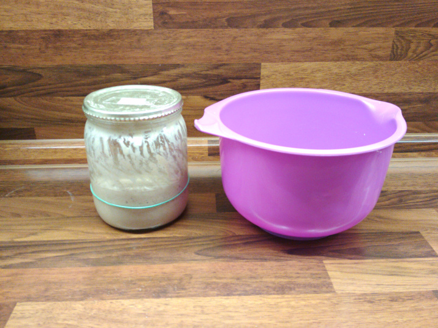

Okolo 20:00 treba zacat robit "rozkvas":

* 150g hladkej muky

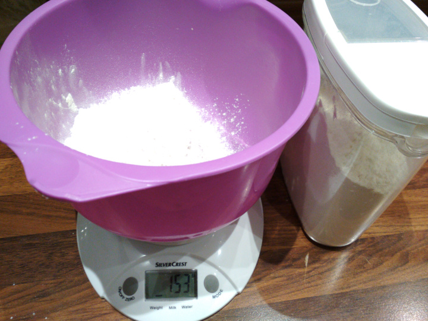

* 40g cukru

* 65g vody

* 1 polievkovej lyzice kvasku

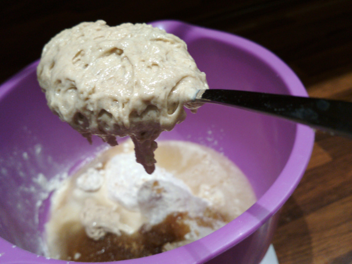

Zmiesame to dokopy (naprv lyzicou, ktorou som nabral kvasok - kto bude tolko veci umyvat).

Potom do toho zapojime ruku (recept je vhodny aj pre lavakov). Prelozim z jednej strany na druhu a pritlacim.

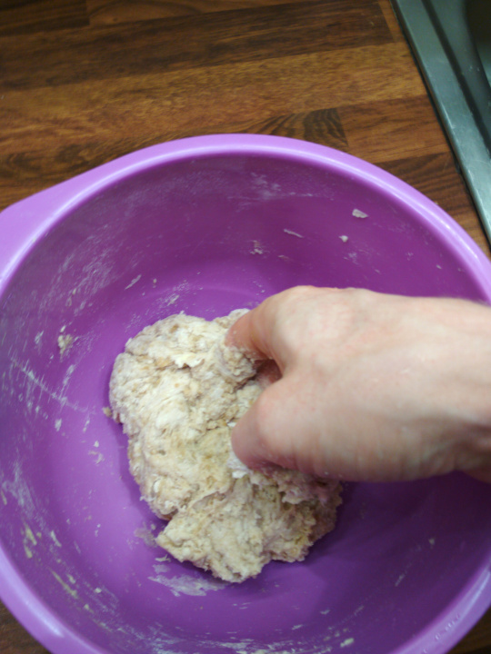

Finalny stav rozkvasu vyzera takto:

Potom to zakryjeme a na 12 hodin nechame spinkat.

## Day 2

Po 12 hodinach rozkvas vyzera takto:

Ideme pripravit "sladke mlieko":

* 100g masla

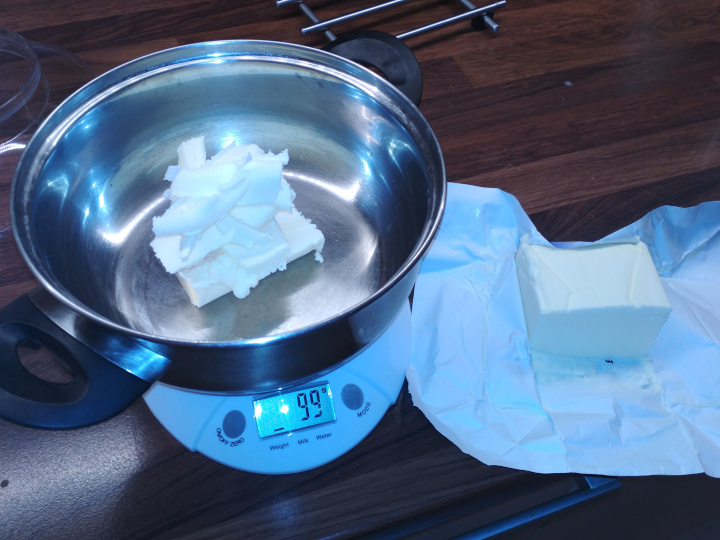

* 100g cukru (nemusi byt hnede - ine som nemal doma)

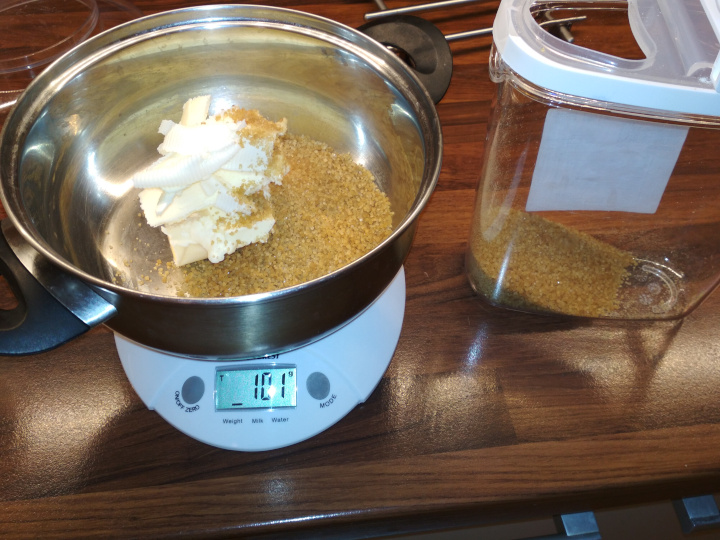

* 130ml mlienka

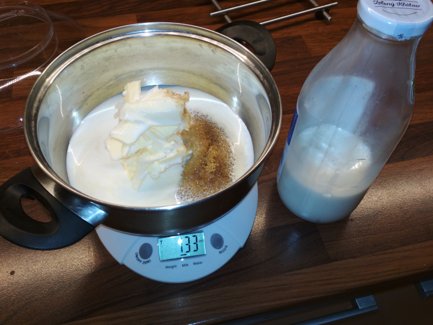

* 1 zltok

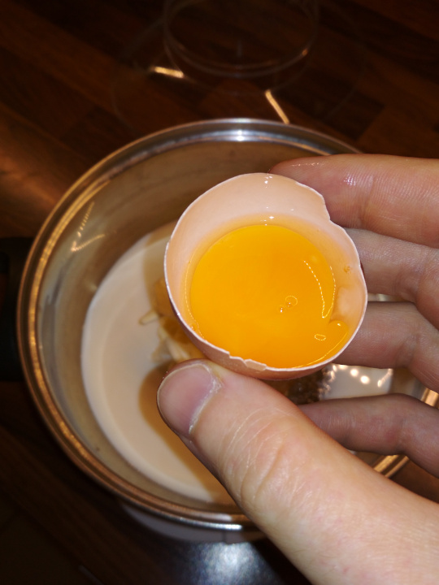

Sladke mlieko dame varit, kym sa neroztopi v nom cukor a maslo:

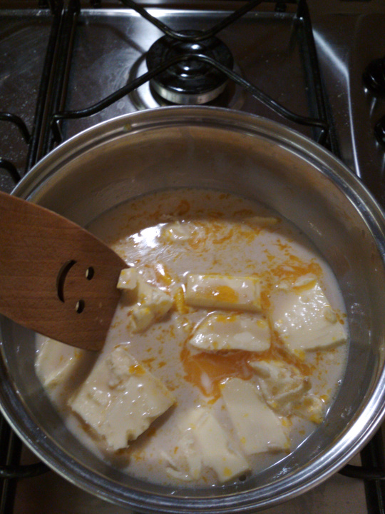

Ked to vyzera, ako fazulova polievka, tak este treba varit dalej:

Hotove sladke mlieko:

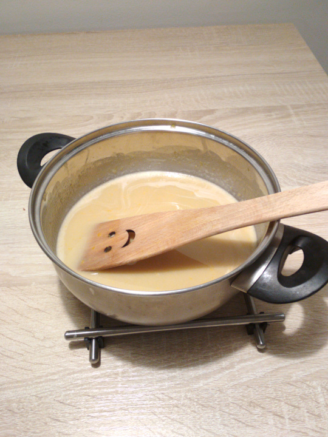

Je to horuce, tak to dame vychladnut - napr. na balkon. Raz za 5 min to trosku rozmiesame. Za takych 20-30min je to ready.

Ideme zmiesat cesto. Do nadoby s rozkvasom pridame:

* 300g hladkej muky

* Stipku soli - tj kolko sa nam zmesti medzi 2 prsty

* Stipku vanilkoveho cukru - tj kolko sa nam zmesti medzi 2 prsty. Moj vanilkovy cukor je len obycajny cukor zmiesany s vanilkou.

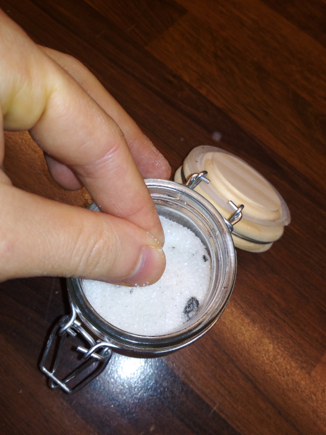

* Sladke mlieko - pozri, ako sa tesi!

Aaaa zacneme miesat cistou rukou:

Vysledkom ma byt taketo relativne tuhe a mastne cesto:

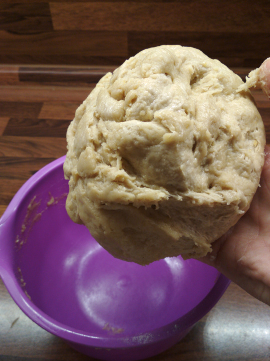
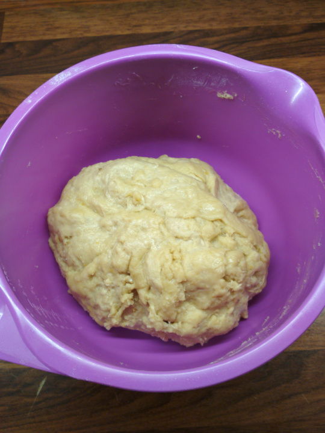

Cesto zakryjeme a nechame pracovat na 1 hodinu. Po 1 hodine to vyzera takto:

Cesto trosku zmasirujeme - prelozime z jednej strany na druhu a pritlacime. Potom cesto zase zakryjeme a nechame dalej pracovat 1 hodinu.

Po 2 hodinach cesto vyzera takto:

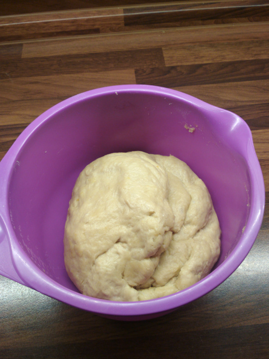

Cesto trosku zmasirujeme - prelozime z jednej strany na druhu a pritlacime. Potom cesto zase zakryjeme a nechame dalej pracovat 1 hodinu.
