# Vianocka z kvasku

[Dalsie recepty](README.md)

Povodny recept: https://nelkafood.sk/vianocka-z-kvasku/

## Ingrediencie

* Rozkvas (priprava popisana nizsie)
    * 150g hladkej muky
    * 40g cukru
    * 65g vody
    * 1 polievkovu lyzicu kvasku
* Sladke mlieko (priprava popisana nizsie)
    * 1 zltok (tj. zlta cast vajca)
    * 130ml mlieka
    * 100g cukru
    * 100g masla
* Cesto
    * 300g hladkej muky
    * stipka soli
    * stipka vanilky / vanilkoveho cukru
    * Rozkvas (priprava popisana nizsie)
    * Sladke mlieko (priprava popisana nizsie)
* Na dokoncenie
    * 1 vajce (na potretie)

## Day 1

Okolo 16:00h treba nakrmit kvasok. Staci malo, do receptu ide len 1 polievkova lyzica, cize staci napr 20g:20g (voda:muka).

Okolo 20:00h treba zacat robit "rozkvas":

* 150g hladkej muky

* 40g cukru

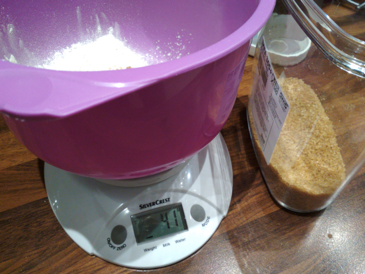

* 65g vody

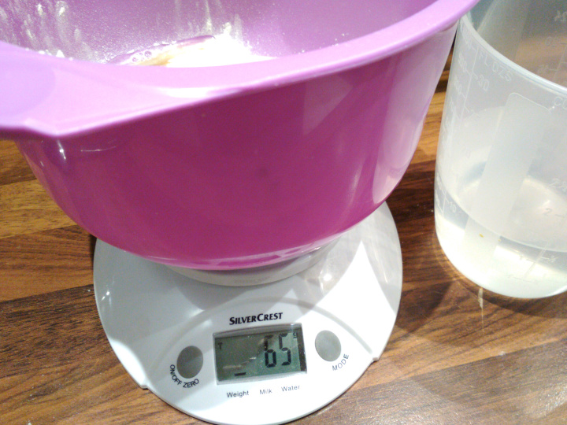

* 1 polievkova lyzica kvasku

Zmiesame to dokopy (naprv lyzicou, ktorou som nabral kvasok - kto bude tolko veci umyvat).

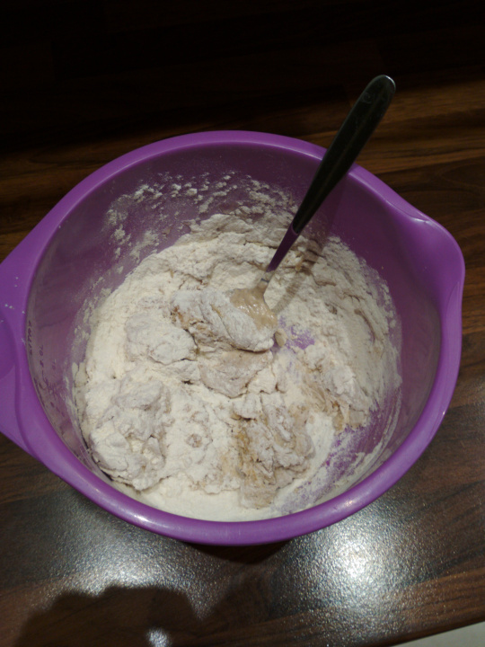

Potom do toho zapojime ruku (recept je vhodny aj pre lavakov). Cesto prelozim z jednej strany na druhu a pritlacim.

Finalny stav rozkvasu vyzera takto:

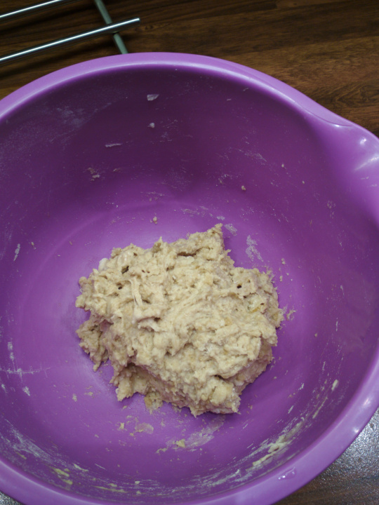

Potom to zakryjeme a na 12 hodin nechame spinkat.

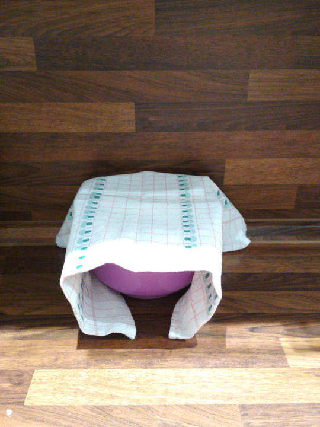

## Day 2

Po 12 hodinach rozkvas vyzera takto:

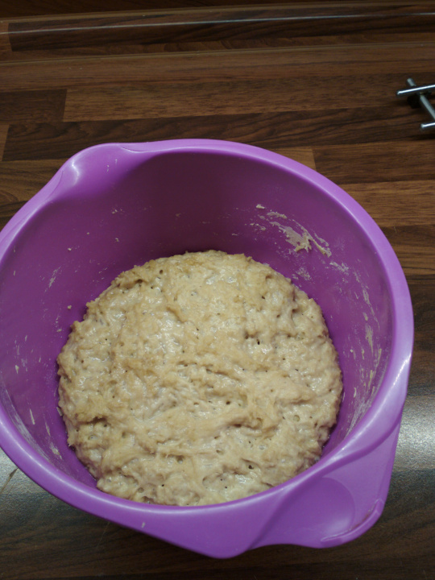

Ideme pripravit "sladke mlieko":

* 100g masla

* 100g cukru (nemusi byt hnedy - ine som nemal doma)

* 130ml mlieka

* 1 zltok

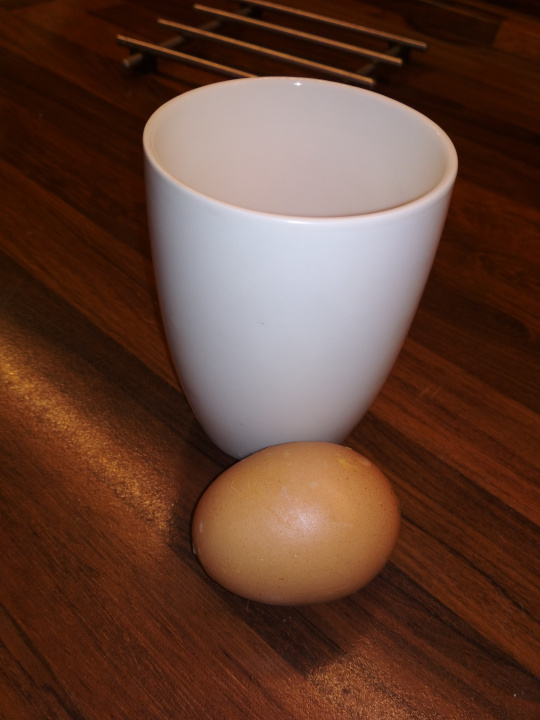

Sladke mlieko varime na miernom ohni, kym sa v nom neroztopi cukor aj maslo (nemalo by to vriet):

Ked to vyzera, ako fazulova polievka, tak este treba varit dalej:

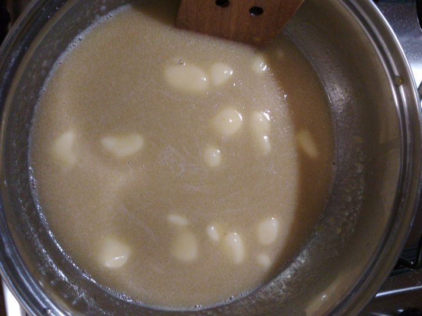

Hotove sladke mlieko:

Je to horuce, tak to dame vychladnut - napr. na balkon (pozor na holuby). Raz za 5 min to trosku premiesame. Za takych 20-30min je to ready.

Ideme zmiesat cesto. Do nadoby s rozkvasom pridame:

* 300g hladkej muky

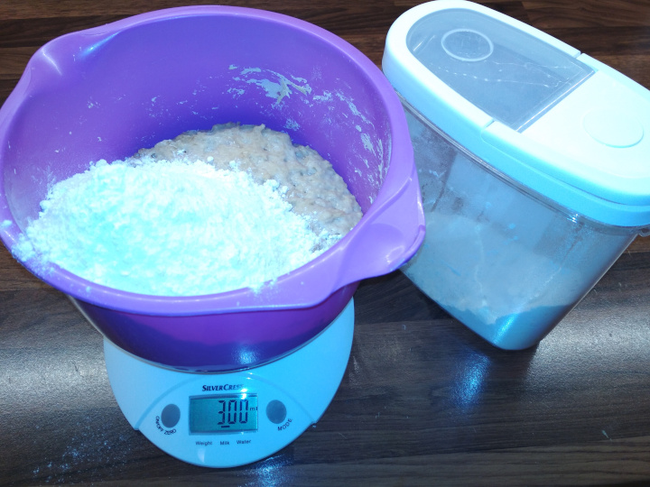

* Stipku soli - tj kolko sa nam zmesti medzi 2 prsty

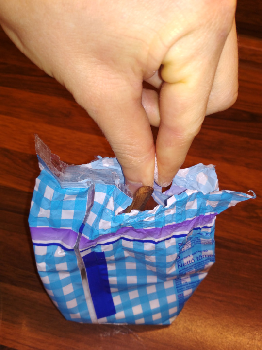

* Stipku vanilkoveho cukru - tj kolko sa nam zmesti medzi 2 prsty. Moj vanilkovy cukor je len obycajny cukor zmiesany s vanilkou.

* Sladke mlieko - pozri, ako sa tesi!

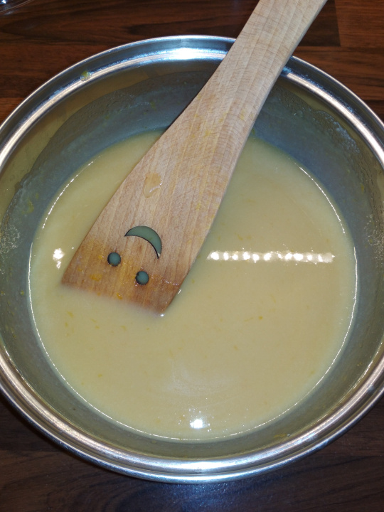

Aaaa zacneme miesat cistou rukou:

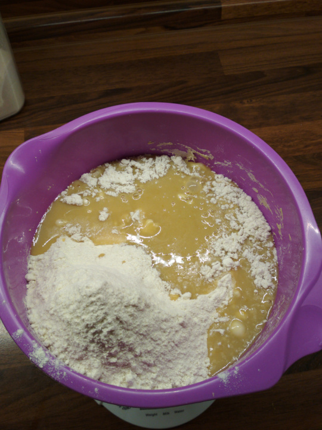
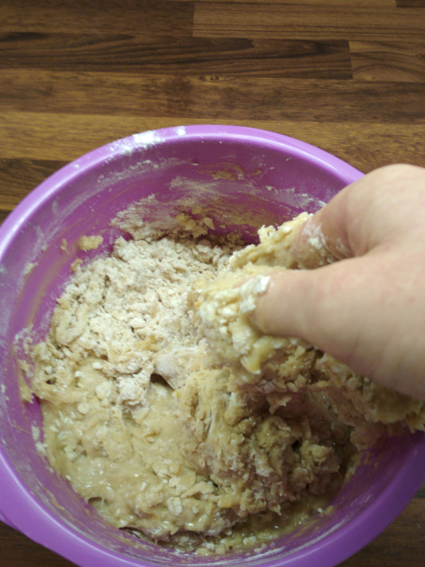

Vysledkom ma byt taketo relativne tuhe a mastne cesto:

Cesto zakryjeme a nechame oddychovat 1 hodinu. Po 1 hodine to vyzera takto:

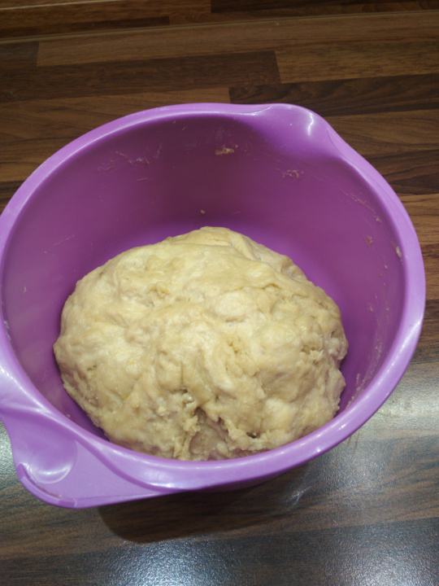

Cesto trosku zmasirujeme - prelozime z jednej strany na druhu a pritlacime. Potom cesto zase zakryjeme a nechame dalej oddychovat 1 hodinu.

Potom to vyzera takto:

Cesto trosku zmasirujeme - prelozime z jednej strany na druhu a pritlacime. Potom cesto zase zakryjeme a nechame dalej oddychovat 1 hodinu.

Potom to vyzera takto:

Cesto rozdelime podla vahy na 6 rovnakych casti (cca 155g/kus):

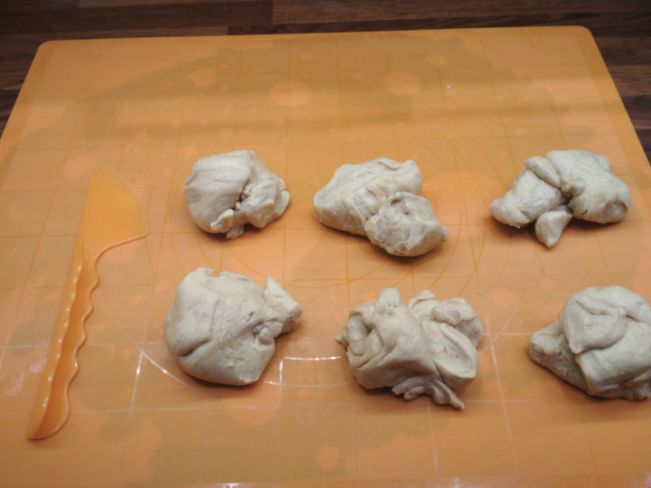

Z jednotlivych casti spravime gule. Rukou ich postlacame a vytvarujeme do gule:

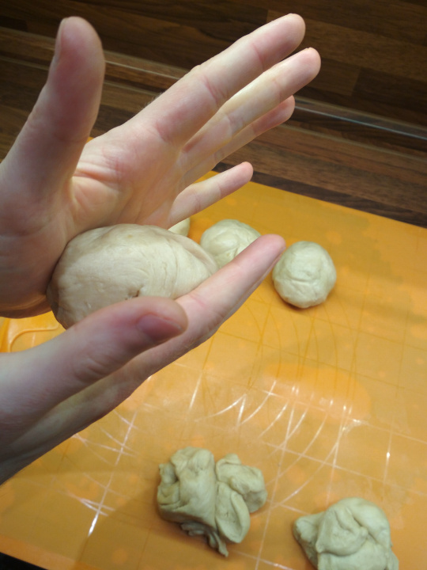

Potom tie gule zakryjeme na 20 minut. Kuk:

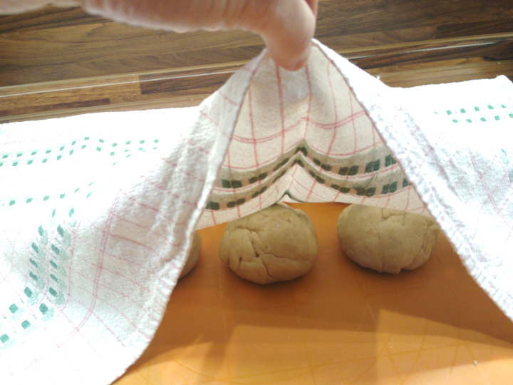

Po 20 minutach ideme konecne na to. Kazdu gulu zrolujeme do "pramenov". Naraz aj rolujeme, aj stlacame cesto. Najprv jednou rukou (na zaciatku rolovania mame zavrete prsty a potom ich postupne otvarame a tym roztahujeme cesto. Aplikujeme pri tom aj tlak).

Potom pouzijeme obe ruky a nadalej rolujeme a roztahujeme cesto na dlzku cca 40cm.

Nachystame plech s papierom na pecenie. Kedze sme ekologicki, tak pouzijeme uz pouzity papier (vsimni si flak od chleba).

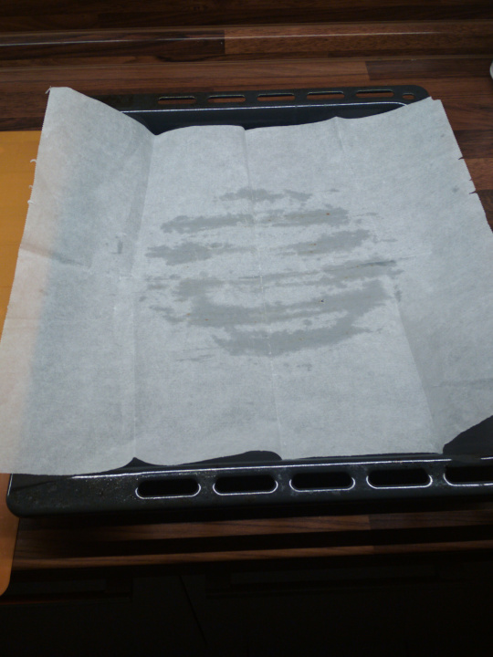

Jednotlive pramene rozdelime do dvoch skupin po 3 a konce spojime/stlacime:

Ideme na pletenie. Kazdy pramen je na pozicii L1-L3 a P1-P3 (cislo 1 je na kraji na oboch stranach):

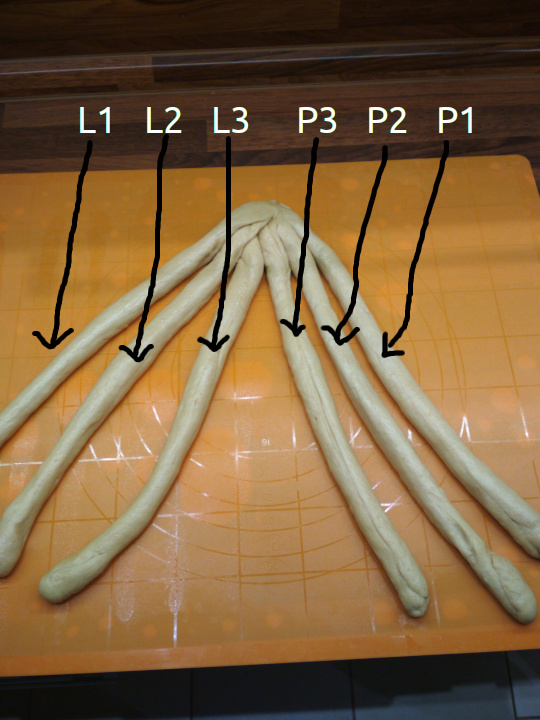

Posun L1 -> P1 vyzera takto:

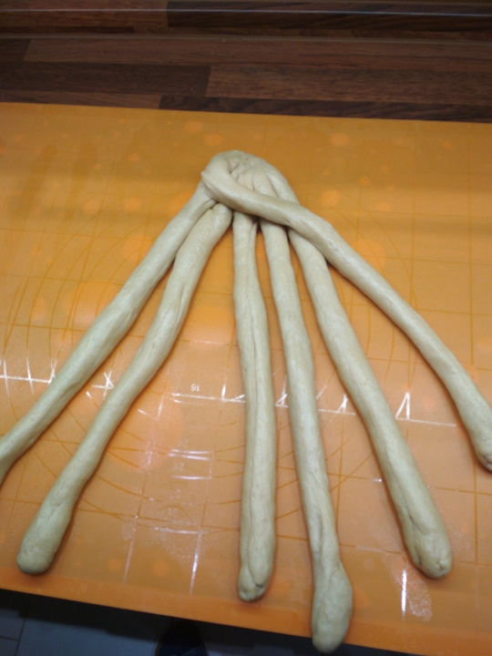

To znamena, ze zoberem pramen na pozicii L1 a dam na P1. Tym padom pramen, ktory bol predtym na L2 je uz po novom na pozicii L1. Takto miesam jednotlive pramene.

Pletenie robim v takomto poradi:

* L1 -> P1
* P2 -> L1
* P1 -> P3
* L2 -> P1
* L1 -> L3
* P2 -> L1
* P1 -> P3
* L2 -> P1
* L1 -> L3
* P2 -> L1
* P1 -> P3
* L2 -> P1
* L1 -> L3
* P2 -> L1
* P1 -> P3

Ak ti este zostali nezapletena cast pramenov, tak pokracuj od zaciatku poradia. Konce spojime stlacenim:

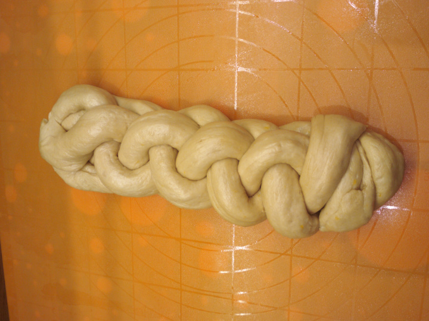

Potom opatrne polozime vianocku na plech:

Vianocku zakryjeme a nechame oddychovat 4 hodiny. Potom vianocka vyzera takto:

Rozmiesame si vajicko v salke a natrieme nim vianocku (aj boky - netreba sa toho bat. Vajicko doda vianocke farbu a lesk).

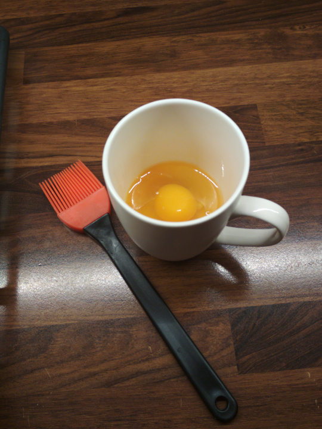

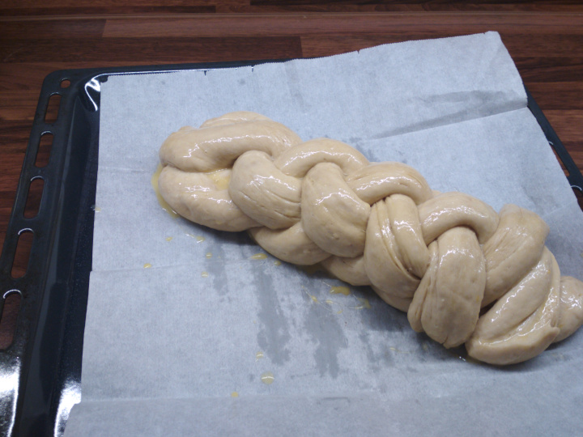

Potom dame vianocku do rury na 7 minut na 230C.

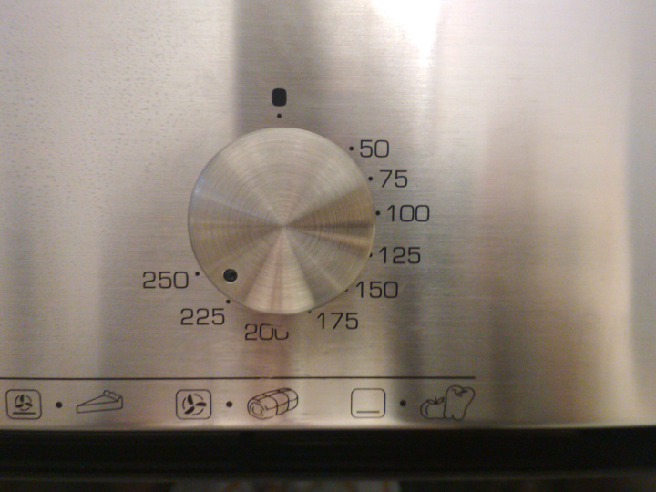

Vianocka po 7 minutach vyzera takto:

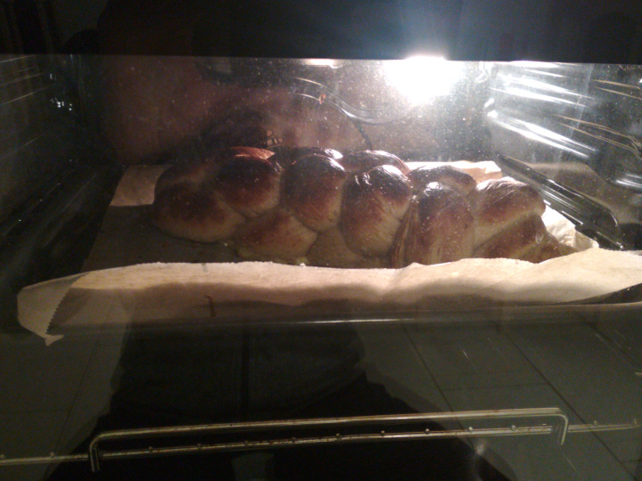

Stiahneme ruru na 175C. Potom otvorime dvere rury a dame papier na pecenie na vrch vianocky.

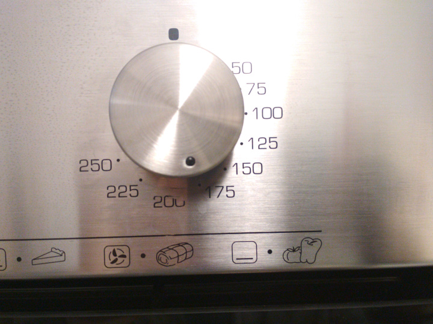
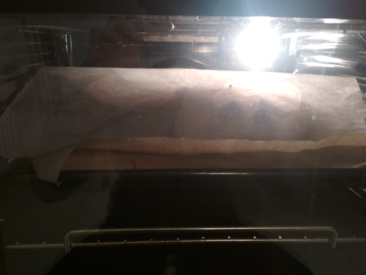

Po 30 minutach vyberieme z rury hotove dielo:

